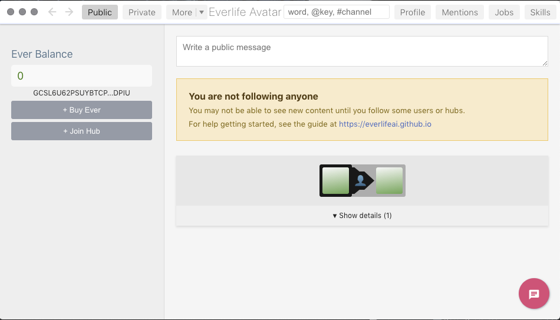
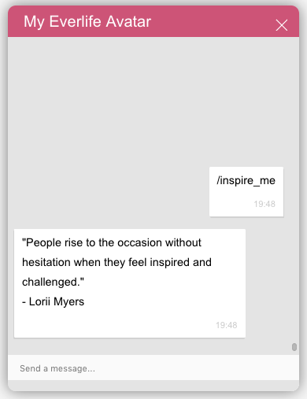

# Coding a simple skill

In this guide we will be coding and adding a custom skill to our avatar. The scope of this guide is to create a custom skill for you own (non hosted) avatar. When we are done we will have extended our own avatar with some custom functionality, only available to us as the owner of the avatar. This guide will not touch on the subject of distributing a skill or selling it to others in a marketplace. 

## Prerequisites 

* Set up your avatar for development according to [the setup instructions](../../getting-started/dev-setup.md).
* You will need som basic JavaScript coding skills to be comfortable following this guide.
* A OS terminal / shell application in which you can issue commands. For MacOS or Linux you typically use the `Terminal`. On Windows you use the `Command Prompt` or you can try out the new [Ubuntu `bash` shell](https://www.howtogeek.com/249966/how-to-install-and-use-the-linux-bash-shell-on-windows-10/) that is included with Windows 10.

Note: We will be primarily using MacOs commands in this guide. However, it should be fairly straightforward to follow along as a Windows or Linux user.

Note: This guide is written for the EverLife Avatar version 0.9.2

## Requirements

Let's start with thinking about what we would like our new skill to do. What functionality would we like to add to our avatar? Typically a skill of this kind extends the way we communicate with our avatar, i.e. it will add a command that the avatar can react and respond to. 

For example, issuing a typical command is to type `/whoami` in any of the communication channels. This will trigger the `eskill-about` to respond with details on your avatar in the same communication channel. A skill can do anything, so that might sound a little limited but lets learn how to walk before we take on the task of writing our own home automation integration.

So, let's create a skill that can give us some more inspiration. How's that for bootstrapping yourself towards greatness? Let our requirements be that if I as an avatar owner gives the command `/inspire_me`, my avatar should give me an inspirational quote back.

## Before you begin - fasten seat belts

We should just check that your avatar setup is working as it should. Start your avatar.

    ./run-mac.sh
   
If everything is installed correctly you should now see the avatar GUI, including the "My Evelife Avatar" chat box icon on the lower left in the avatar gui. 

## Coding the skill

To create a skill you will need a minimum of two files and a folder.

Let's create the folder `~/everlifeai/0/skills/eskill-inspire`

    mkdir ~/everlifeai/0/skills/eskill-inspire
    
Warning: If you get an error trying to create the directory you might have a customized skill location. In that case check your directory `~/everlifeai/0` to see if there are any additional subdirectories there in which your `skills` folder is located, and use that.     
    
In that folder create two files:

    cd ~/everlifeai/0/skills/eskill-inspire
    touch package.json
    touch index.js
 
### Node.js manifest file

Since every skill is a node.js module we need to set up some scaffolding for that module. The `package.json` is the manifest for your skill. This file is a standard NPM file. Use an editor to add the folowing contents to `package.json`:

```json
{
  "name": "eskill-inspire",
  "version": "1.0.0",
  "description": "A skill for inspiration",
  "main": "index.js",
  "license": "MIT",
  "dependencies": {
    "cote": "^0.17.3",
    "elife-utils": "everlifeai/elife-utils",
    "request": "^2.88.0"
  }
}
```

### `index.js` - the code

Next, lets edit the `index.js` file and add the code for our skill.

```javascript
'use strict'
const cote = require('cote')({statusLogsEnabled:false});
const u = require('elife-utils');
const request = require('request');

function main() {
    startMicroservice();
    registerWithCommMgr();
}

let msKey = 'eskill-inspire';

const commMgrClient = new cote.Requester({
    name: 'elife-inspire -> CommMgr',
    key: 'everlife-communication-svc',
});

function sendReply(msg, req) {
    req.type = 'reply';
    req.msg = msg;
    commMgrClient.send(req, (err) => {
        if (err) u.showErr(err)
    })
}

function registerWithCommMgr() {
    commMgrClient.send({
        type: 'register-msg-handler',
        mskey: msKey,
        mstype: 'msg',
        mshelp: [
            { cmd: '/inspire_me', txt: 'Show me today`s inspirational quote.' }
        ],
    }, (err) => {
        if (err) u.showErr(err)
    });
}

function startMicroservice() {
    const svc = new cote.Responder({
        name: 'Everlife Inspiration Service',
        key: msKey,
    });

    svc.on('msg', (req, cb) => {
        if(!req.msg) return cb();
        if(req.msg.trim() === "/inspire_me") {
            cb(null, true);
            getQuote((quote, err) => {
                if (!err) {
                    sendReply(`"${quote.quote}"\n\t - ${quote.author}`, req)
                } else {
                    sendReply(err, req)
                }
            })
        }
        else {
            return cb();
        }
    })
}

function getQuote(cb) {
    request('http://quotes.rest/qod.json', function (error, response, body) {
        if (!error && response.statusCode === 200) {
            const quote = JSON.parse(body).contents.quotes[0];
            cb(quote);
        } else {
            if (error) u.showErr(error);
            cb(null, `Sorry couldn't get a quote for you just right now.`);
        }
    })
}

main();
```

## Building the skill

The "building" phase means to download the required javascript dependencies and make the code ready to run together with the rest of the avatar processes. Building is done by issuing the command:

    cd ~/everlifeai/0/skills/eskill-inspire
    npm install
    
The important thing here is that you are located in the folder of the skill you want to build.

## Load the skill and test it

Once you have built the skill in the skills folder it will be automatically started when the avatar is restarted. There is also a shortcut you can use to reload the skills without restarting the avatar.

    pm2 restart elife-communication-mgr elife-skill-mgr
    
Now you should be able to issue the new command `/inspire_me` to your avatar and get a response: 

## Testing and tweaking the skill

Development is an iterative process. You write some code, try it out and then adjust it. It is often helpful to be able to reload any changes quickly. A simple way to reload your skill without having to restart the GUI is to use this command:
    
    pm2 restart elife-communication-mgr eskill-inspire

It restarts the communication manager and our skill. This reloads all the skill code.

Note: If you change any dependencies, i.e. the `package.json` file, you will need to rebuild the skill with `npm install` before you reload it.

### Checking the logs for the skill

Install the PM2 command line tools by following [this dev trick](../../getting-started/dev-tricks.md#using-pm2). Now you can use the following command to show the logs for your specific skill only. This can be extremely helpful when doing development.

    pm2 logs eskill-inspire

## Further things to try out

1. Get your skill to display a random quote instead of "Quote of the Day" Hint: You need to get an API key from [https://theysaidso.com/api/](https://theysaidso.com/api/) to access some other rest endpoints. 
2. Add some parameters to the command to let you select a quote from the different categories available.

- - - -
[Suggest an edit for this page](https://github.com/everlifeai/everlifeai.github.io/edit/master/docs/developer-resources/dev-guides/coding-a-skill/coding-a-skill.md)
