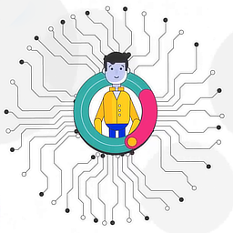

# Welcome to the Everlife.AI Project Wiki

[This wiki](https://everlifeai.github.io) is our main documentation resource for avatar developers and avatar owners. Please use the top level navigation to browse the documentation or click the images below to jump directly into the developer or owner sections of the wiki. We love feedback! You can reach us using the information on the [contacts](docs/contact.md) or submit suggestions to this Wiki through the links at the bottom of each page. Also check out our [contribution guide](docs/developer-resources/contribution/contribution.md).

| **For Developers**  |  **For Avatar Owners**  |
|:-:|:-:|
|   |   |
| Information on how to get started coding to extend or modify your EverLife avatar. This section assumes that you have some programming experience and some tools installed. | Information on how to become an avatar owner and handle your EverLife avatar, without programming it. |

_Photos by Kevin Ku and Bruce Mars from Pexels._

- - - -
[Suggest an edit for this page](https://github.com/everlifeai/everlifeai.github.io/edit/master/index.md)

